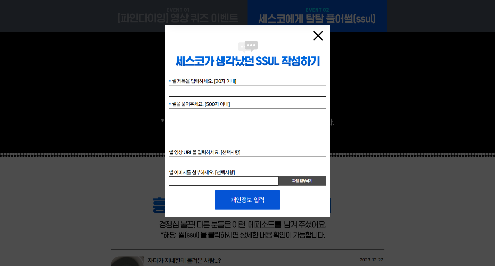
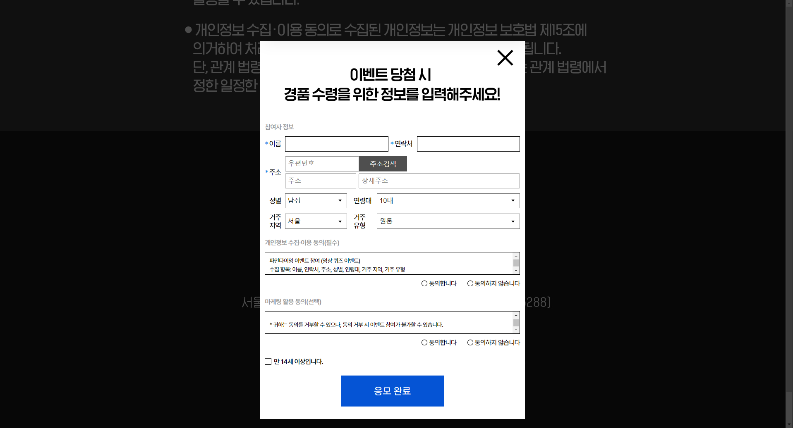

# 세스코 프로모션 사이트

## 프로젝트 정보
- **제작 기간** : 2023
- **제작 도구** : Intellij
- **사용 기술** : HTML5, CSS3, SCSS, JavaScript, Git, Webpack
- **팀 규모**: 5명 (기획자1, 디자이너1, 퍼블리셔2, 백엔드1)

## 프로젝트 설명
- fetch() 함수 활용해서 api 호출
- 개인정보 입력시 validation 체크
- 경품 이벤트 참여 이벤트 작업. //정답 or 오답시 팝업 이미지 보여지게 작업
- youtube api 사용해서 작업

## 프로젝트 구조
- 📂 __resource/ — 개발 소스 (js, scss)
- 📂 api/ - 퀴즈 참여, 썰 풀기 이벤트 작업물
- 📂 assets/ — 빌드 결과물 (배포용)
- 📄 index.php

## 작업 이미지

